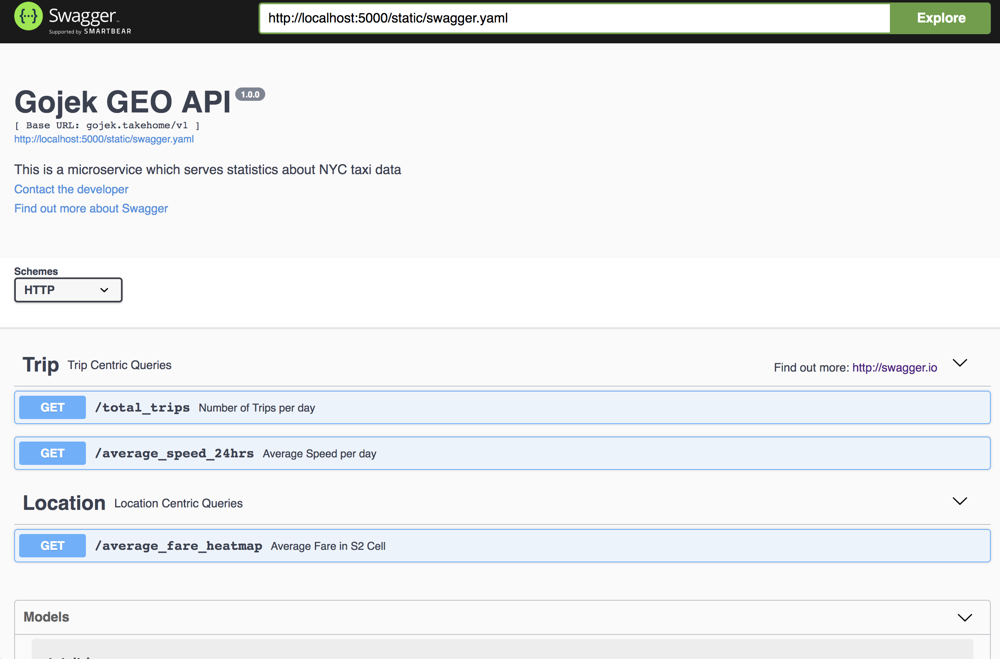

> Repository storing the codebase required for the takehome test (2weeks)

# Takehome Solution

<!-- vim-markdown-toc GFM -->

  * [Folder Organisation](#folder-organisation)
  * [Getting Started](#getting-started)
    * [Installation Guide](#installation-guide)
    * [Connecting to service](#connecting-to-service)
      * [[Option 1] Port Forwarding](#option-1-port-forwarding)
      * [[Option 2] Directly Querying the public IP](#option-2-directly-querying-the-public-ip)
    * [Swagger: API documentation](#swagger-api-documentation)
    * [Heartbeat / Healthcheck](#heartbeat--healthcheck)
    * [Endpoints](#endpoints)
      * [1. Total Trips](#1-total-trips)
      * [2. Fare Heatmap](#2-fare-heatmap)
      * [3. Average Speed](#3-average-speed)
* [FAQ](#faq)

<!-- vim-markdown-toc -->

## Folder Organisation

Starting with the root directory, you will find several folders:

* `terraform` necessary scripts to recreate infrastructure eg. GKE cluster.
* `helm-charts` µservice as an installable app using K8S's de-facto package manager _helm_ (similar to brew but for installing into K8S clusters)
* `precompute` Contains the scripts to generate the data served by the APIs
* `notebook` stores EDA notebook
* `components` SRC folder for various components required for µservice. Flask app, geoapi, is one such component. extensible in future to include cache, db, etc

As well as standalone files:

* [cloudbuild.yaml](./cloudbuild.yaml) for build instructions; publishing images to GCR and installing the latest package
* [INSTRUCTIONS.md](./INSTRUCTIONS.md) which stores the takehome's instructions

## Getting Started

The µservice has already been setup on Google Cloud Platform, skip ahead to **Connecting to service** to try endpoints, else you can set up your own service following installation guide below.

### Installation Guide

Follow the [installation guide](./docs/00-introduction.md). We will be using terraform to set up a mananged K8S cluster on GCP, and install the µserice application using helm. continuous deployment is managed by cloudbuild.

### Connecting to service

#### [Option 1] Port Forwarding

To test the APIs you can use `kubectl` to port forward the service to your localhost at port `5000`:

  ```bash
  $ kubectl port-forward svc/gojek-microservice-geoapi 5000:80
  ```

  > **NOTE**: export `KUBECONFIG` ENV VAR pointing to credentials (`.kubeconfig`) included in submission email. Or use your own if you've set up your own cluster.


#### [Option 2] Directly Querying the public IP

  We are using GCP's public loadbalancer for this serivce which can be found at _______. So you can replace `localhost:5000` with __________


### Swagger: API documentation

  [Swagger docs](https://swagger.io/docs/specification/2-0/what-is-swagger/) can be found hosted at the following route `/v1/docs`

  [](localhost:5000/v1/docs)


### Heartbeat / Healthcheck

  Livenes and Readiness probes are pointed at this endpoint

  ```bash
  $ curl localhost:5000/heartbeat
  ```

### Endpoints

#### 1. Total Trips


  Returns the #trips for within a period. Date given in `%Y-%m-%d` format

  ```bash
  $ curl "localhost:5000/v1/total_trips?start=2015-01-01&end=2015-01-15"
  ```

#### 2. Fare Heatmap

  Returns the average fare in a given S2 Cell

  ```bash
  $ curl "localhost:5000/v1/average_fare_heatmap?date=2015-01-02"
  ```

#### 3. Average Speed

  Returns the average speed for a given day

  ```bash
  $ curl "localhost:5000/v1/average_speed_24hrs?date=${DATE}"
  ```

# FAQ

Any questions, please forward them to Wesley at etheleon [at] protonmail [dot] com.
