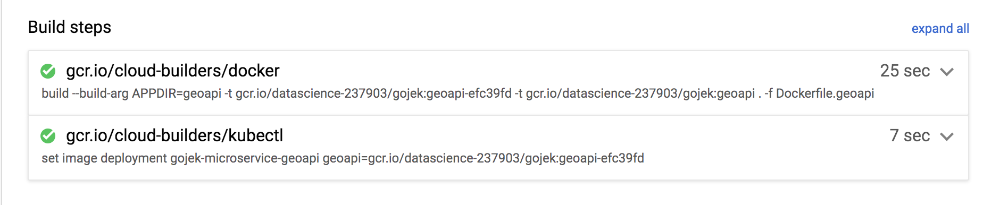

# Continuous Deployment

We will be using [cloud build](https://cloud.google.com/cloud-build/) to redeploy our application upon any changes commited to this respository.

> We are not running any tests for this takehome

## Prerequisites

You will have to allow access for cloudbuild kubectl to update the deployment's image:

```
PROJECT="$(gcloud projects describe \
    $(gcloud config get-value core/project -q) --format='get(projectNumber)')"

gcloud projects add-iam-policy-binding $PROJECT \
    --member=serviceAccount:$PROJECT@cloudbuild.gserviceaccount.com \
    --role=roles/container.developer
```

## Continuous Deployment

To achieve CD, our [cloudbuild.yaml](../cloudbuild.yaml) has two steps, the first builds the image and publishes this to Google Container Registry with the shorted SHA as the tag while the deployment step using the `kubectl` to upgrade the image tag of the deployment.




### Publishing image

```
...
- name: 'gcr.io/cloud-builders/docker'
  args: [
    'build',
    '--build-arg', 'APPDIR=geoapi',
    '-t', 'gcr.io/$PROJECT_ID/gojek:geoapi-$SHORT_SHA',
    '-t', 'gcr.io/$PROJECT_ID/gojek:geoapi',
    '.', '-f', 'Dockerfile.geoapi'
    ]
  dir: 'components'
...
images:
  - 'gcr.io/$PROJECT_ID/gojek:geoapi-$SHORT_SHA'
  - 'gcr.io/$PROJECT_ID/gojek:geoapi'
```


`Docker` is used to build image file based on [Dockerfile.geoapi](../components/Dockerfile.geoapi) and is tagged with two separate tags `geoapi` and `geoapi-$SHORT_SHA`. The latter is used for rollbacks and updating the current image. The former is used when a complete reinstall of the application is required.

### Deployment

```
...
- name: 'gcr.io/cloud-builders/kubectl'
  args:
  - set
  - image
  - deployment
  - gojek-microservice-geoapi
  - geoapi=gcr.io/$PROJECT_ID/gojek:geoapi-$SHORT_SHA
  env:
  - 'CLOUDSDK_COMPUTE_ZONE=asia-southeast1-b'
  - 'CLOUDSDK_CONTAINER_CLUSTER=altimit'
...
```

`kubectl` is used for updating the image for the deployment `geojek-microservice-geoapi`
