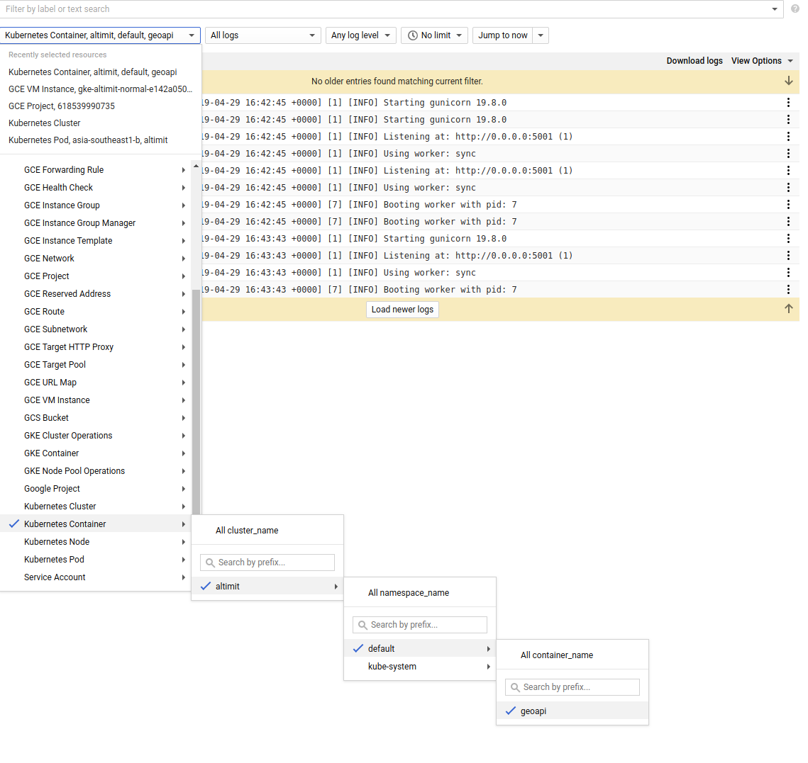

# Serving


## Getting Started

We have requested for a static global IP:


```bash
$ terraform output service_ip
```

So replace `localhost:<port>` with these the ip address.


## Logging

Because it's served on a K8S cluster, you can view the logs via `kubectl logs <pod>`

If you want to query all logs, you can use stackdriver 


